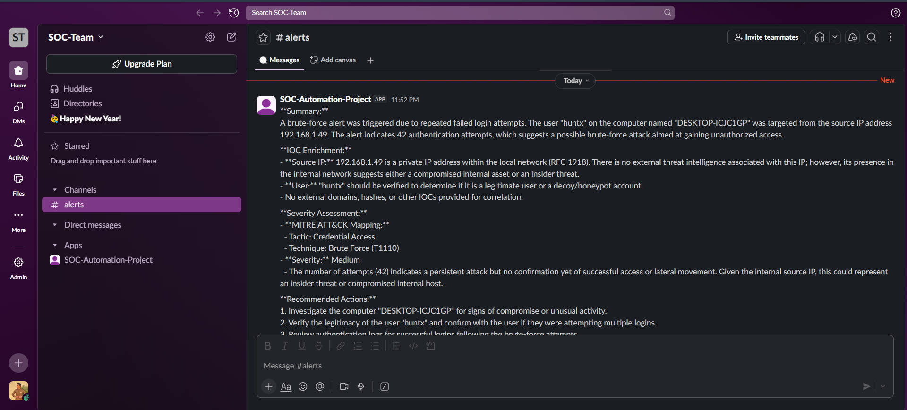
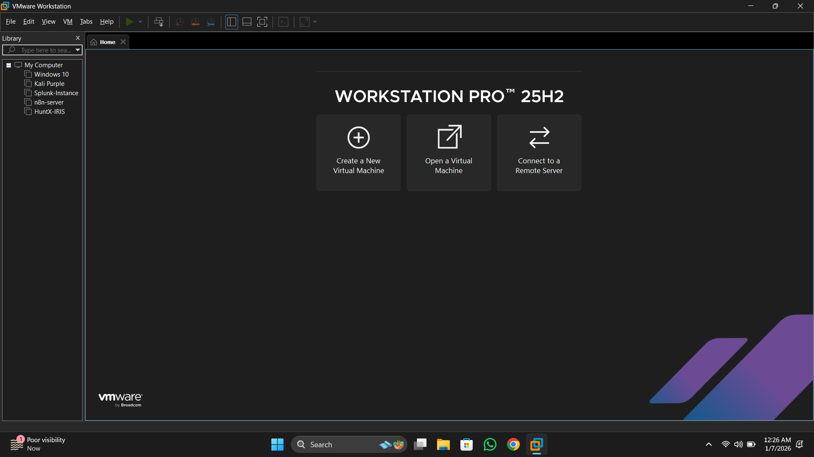
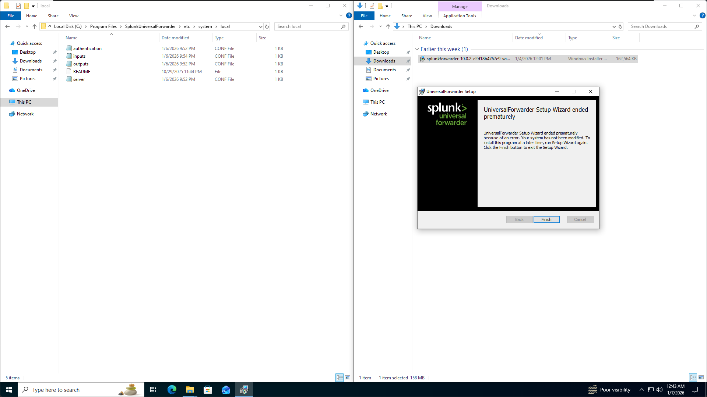
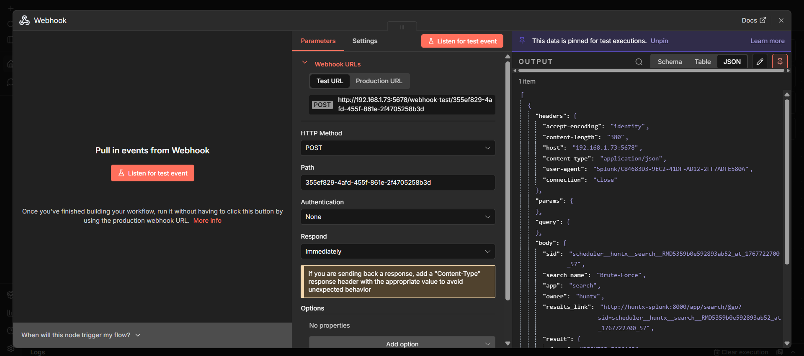
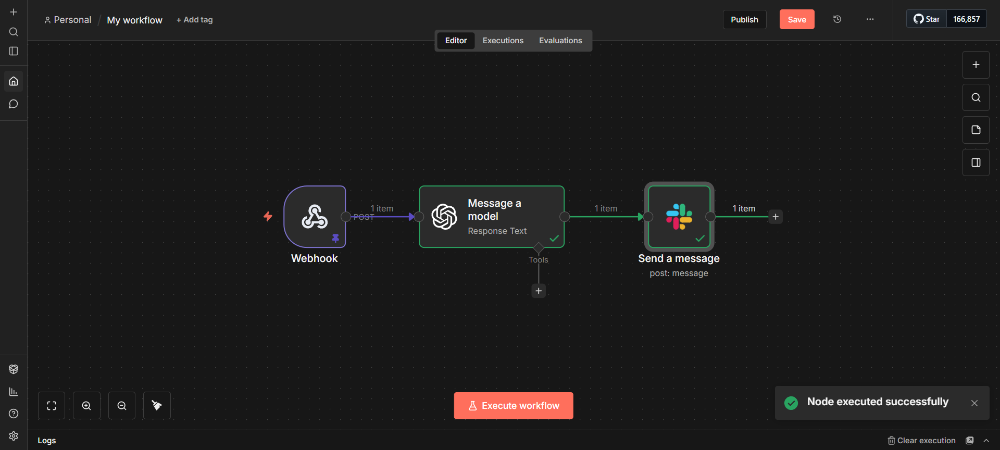
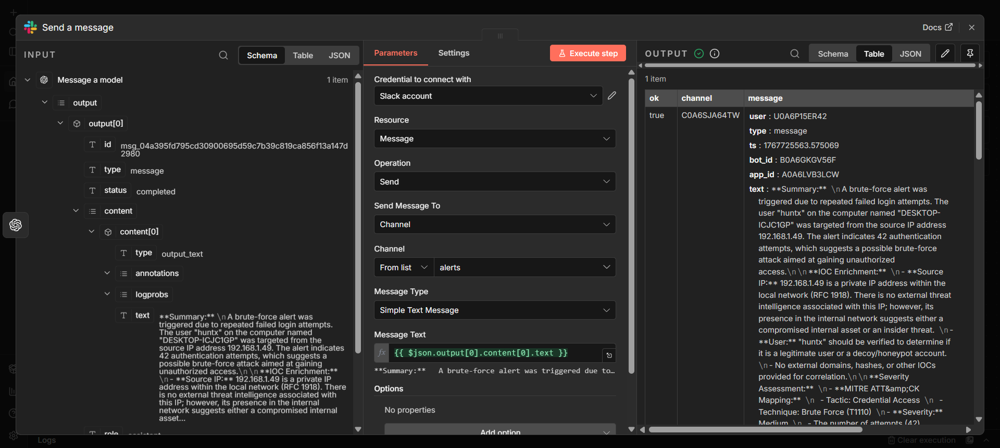
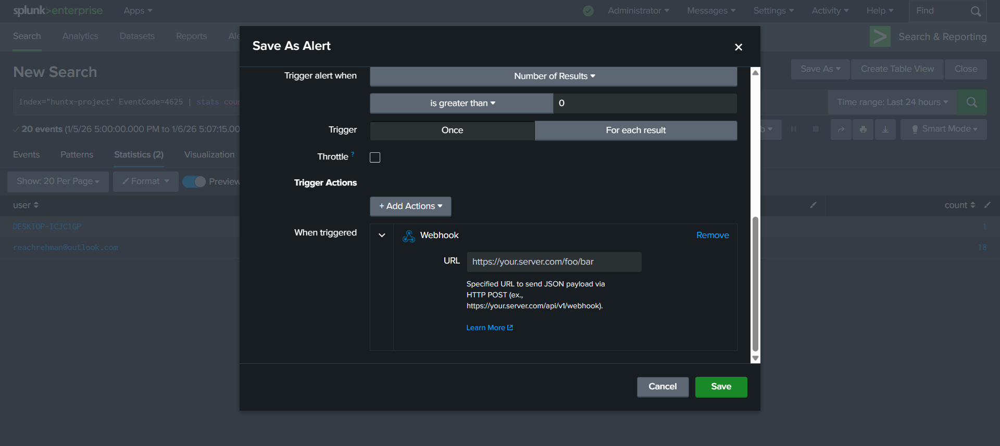
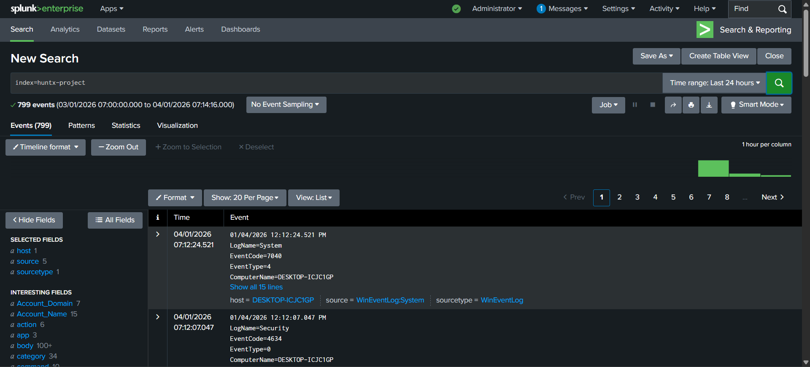
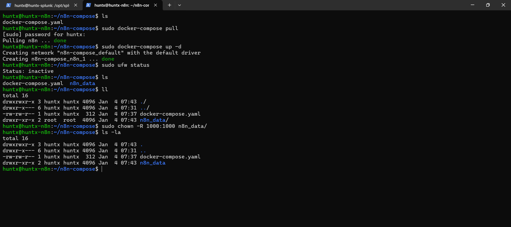

# SOC Alert Automation with Splunk, n8n & Slack

## Overview

I built an end-to-end SOC alert automation pipeline that takes raw Splunk alerts and turns them into fully enriched, ready‑to‑act notifications in Slack. The workflow automatically maps activity to MITRE ATT&CK, enriches IOCs, and gives the SOC team clear, step‑by‑step response actions — all in under 10 seconds from detection to Slack.

**Tech Stack:** Splunk Enterprise, n8n, Slack, Docker, Anthropic (Claude) / OpenAI, Windows 10, Linux  
**Role:** I designed, installed, configured, and integrated everything myself  
**Focus:** SOC automation, alert enrichment, MITRE ATT&CK mapping, SOAR concepts



---

## Problem I Wanted to Solve

When I started working with security alerts, I saw a common pain:

- Analysts were spending **15–20 minutes per alert** just on basic context:
  - What does this alert actually mean?
  - Which **MITRE ATT&CK** technique does it map to?
  - What are the IOCs and how serious is this?
  - What should I do next?

I didn’t want analysts (including myself) wasting time copying data between tools and writing the same first-response steps over and over. I wanted:

- Alerts to arrive already enriched and prioritized  
- Clear, consistent **“do-this-next”** guidance for each alert  
- A workflow that junior analysts can confidently follow

So I built this automation to handle the grunt work and let humans focus on investigation and response.

---

## High-Level Architecture

Data flow from detection to Slack:

1. **Windows 10 endpoints**  
   - I installed and configured a Splunk Universal Forwarder on Windows 10 machines.  
   - Security-relevant logs (authentication, PowerShell, process creation, etc.) are forwarded to Splunk.

2. **Splunk Enterprise (Linux server)**  
   - I deployed Splunk Enterprise on a Linux VM in my home lab.  
   - I created correlation searches that look for:
     - Brute-force / multiple failed logins  
     - Suspicious PowerShell usage  
     - Possible privilege escalation  
     - Unusual process execution patterns  
   - When a rule fires, Splunk sends a **webhook** to n8n with a normalized alert payload.

3. **n8n Workflow (Docker)**  
   - I ran n8n in Docker and built a **three-node workflow**:
     1. **Webhook node:** receives the Splunk alert payload.
     2. **AI enrichment node:** calls an LLM (Claude/OpenAI) with a carefully structured prompt to:
        - Summarize what happened in plain English  
        - Extract and enrich IOCs (IP, host, user)  
        - Map to **MITRE ATT&CK** tactic/technique (e.g., T1110 – Brute Force)  
        - Assign a severity level  
        - Generate concrete recommended actions for the analyst  
     3. **Slack node:** sends a formatted message to a dedicated `#alerts` channel.

4. **Slack (#alerts channel)**  
   - The SOC team receives a single, high‑signal message per alert containing summary, context, MITRE mapping, and next steps.

End result: **~10 seconds** from detection in Splunk to a fully enriched alert in Slack.

**Lab view:**

  


---

## n8n Workflow Design

### 1. Webhook Node

**What I did:**

- I created an n8n HTTP Webhook node that listens for incoming POST requests from Splunk.  
- I configured Splunk correlation searches to call this webhook with:
  - Alert name and description  
  - Host, user, IP address  
  - Time range, count, and other relevant fields  

**Why it matters:**

- This is the single entry point for all alerts, so I normalize the input once and reuse the same pipeline for different detection rules.



### 2. AI Enrichment Node

**What I did:**

- I added an HTTP/AI node that sends the alert JSON and a structured prompt to an LLM (Claude/OpenAI) and asks it to:
  - Explain **what happened** in a short, SOC-friendly summary  
  - Identify and list **IOCs**:
    - Source IP / destination IP  
    - Username  
    - Hostname / endpoint  
  - Decide on a **severity** (Low/Medium/High) based on the activity  
  - Map the behavior to **MITRE ATT&CK**:
    - Tactic (e.g., Credential Access)  
    - Technique (e.g., T1110 – Brute Force)  
  - Output **step-by-step recommended actions** for the analyst (triage + containment)

**Example enrichment output:**

- Summary of what triggered the alert  
- IOC list with short comments  
- MITRE ATT&CK tactic + technique + short explanation  
- 3–5 concrete actions the analyst should take next

This turns a raw event into something **directly actionable**.



### 3. Slack Node

**What I did:**

- I configured an n8n Slack node that posts messages into a dedicated `#alerts` channel.
- I formatted the message to include:
  - **Summary** (1–2 lines)  
  - **IOC Enrichment** (bulleted list)  
  - **MITRE ATT&CK Mapping** (tactic, technique, ID)  
  - **Severity**  
  - **Recommended Actions** (numbered list)

**Why this helps:**

- Analysts don’t need to open Splunk immediately. They see **what happened, why it matters, and what to do** right where they already work (Slack).



---

## Example Alert: Brute Force Detection

### 1. Splunk Detection

I created a correlation search in Splunk that fires when there are multiple failed logins from the same IP against the same user in a short time window.

Sample scenario:

- Source IP: `192.168.1.49`  
- Target user: `huntx`  
- Host: `DESKTOP-ICJC1GP`  
- 42 failed login attempts in a few minutes

When this triggers, Splunk sends a webhook with all this data to n8n.



### 2. n8n Processing

In n8n, the workflow:

- Parses the Splunk payload  
- Sends it to the AI enrichment node  
- The AI:
  - Classifies it as **Credential Access**  
  - Maps it to **MITRE ATT&CK T1110 – Brute Force**  
  - Sets severity to **Medium** (lab scenario)  
  - Suggests investigation and containment steps


### 3. Slack Notification

The Slack message looks like this (simplified):

```text
Summary: Brute-force alert triggered due to repeated failed login attempts

IOC Enrichment:
- Source IP: 192.168.1.49 (internal network - possible insider or compromised host)
- User: "huntx" should be verified as legitimate
- Host: DESKTOP-ICJC1GP targeted by repeated logins

MITRE ATT&CK Mapping:
- Tactic: Credential Access
- Technique: Brute Force (T1110)
- Severity: Medium

Recommended Actions:
1. Investigate computer "DESKTOP-ICJC1GP" for signs of compromise.
2. Verify the legitimacy of user "huntx" and check for suspicious activity.
3. Review authentication logs for any successful logins after the brute-force attempts.
```

An analyst can start real investigation immediately without doing manual enrichment.


---

## Technical Setup Details

### Splunk

What I installed and configured:

- Splunk Enterprise on a Linux VM.  
- Splunk Universal Forwarder on Windows 10 endpoints.  
- Inputs for security-related logs (Windows Event Logs, PowerShell, etc.).  
- Correlation searches for:
  - Brute-force attempts  
  - Suspicious PowerShell  
  - Potential privilege escalation  
  - Unusual process execution

Each correlation search:

- Runs on a schedule (e.g., every 5 minutes).  
- Uses SPL to group and count events.  
- Triggers a webhook action with a JSON payload for n8n.



### n8n (Docker)

What I did:

- Pulled and ran n8n with Docker:

```bash
docker-compose pull
docker-compose up -d
```

- Configured environment variables (API keys, Slack tokens) in `.env` / Docker compose.  
- Built the three-node workflow:
  - Webhook → AI Enrichment → Slack



### Slack

What I configured:

- Created a Slack app / bot with permission to post into `#alerts`.  
- Generated and used the bot token in n8n.  
- Designed the message layout to be easy to scan quickly during triage.


---

## Results & Impact

From my testing in the lab, this is what I achieved:

- **Response time:**  
  - Manual: ~15–20 minutes just to gather context.  
  - With automation: **< 1 minute** to have a fully enriched alert and start real analysis.

- **Consistency:**  
  - Every alert follows the same structure: Summary → IOCs → MITRE → Actions.  
  - Junior analysts get the same quality of context as seniors.

- **Learning Tool:**  
  - Repeated exposure to MITRE ATT&CK mappings helps build intuition for attack techniques.  
  - The recommended actions act like mini playbooks embedded in each alert.

---

## Important Note: Lab Environment (Not Production)

I built and tested this in a controlled home lab, not in a live production SOC. The goal here is to show my automation
logic, Splunk/n8n/Slack integration, and MITRE-based triage flow – not a fully hardened enterprise deployment.

This project is **built and tested in a controlled home lab**, not deployed into a live production SOC.

I intentionally kept it as a lab implementation so I could:

- Focus on workflow design and automation logic  
- Iterate quickly on detection + enrichment ideas  
- Learn SOAR principles in a safe environment

Because of that, it is **not production-hardened** yet. For example:

- API keys and credentials are managed at the lab level (no dedicated secrets vault).  
- Webhooks are simplified for testing, not fully locked down.  
- Single-node deployments (no high availability, no load balancing).  
- Lab data may contain real-looking IPs/hostnames without production-grade masking.

### What I Would Do for a Production Rollout

If I were taking this into a real environment, I would:

- **Security & Secrets**
  - Move all API keys and tokens into a proper secrets manager (e.g., HashiCorp Vault).  
  - Enforce TLS/SSL end-to-end (Splunk → n8n → Slack).  
  - Add authentication and verification on all webhooks.

- **Infrastructure & Reliability**
  - Run n8n and Splunk in a highly available setup (e.g., Kubernetes, multiple nodes).  
  - Add monitoring, alerting, and health checks for the automation itself.  

- **Data & Compliance**
  - Implement data masking / redaction for sensitive fields.  
  - Add audit logging, RBAC, and change management.  

The core **automation design and SOC workflow** in this project are what I want to demonstrate; the production hardening steps above are what I would add in a real enterprise environment.

---

## Repository Contents (Planned)

This repo is meant to include:

- `n8n/` — exported n8n workflow JSON for the SOC alert automation  
- `splunk/` — example correlation searches and saved searches  
- `docker/` — `docker-compose.yml` and example `.env` template  
- `docs/` — additional screenshots and setup notes (optional)  
- `soc-automation.md` — this detailed project walkthrough for portfolio / hiring managers

---


